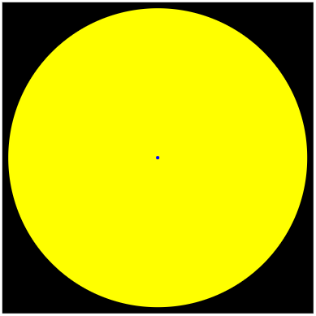
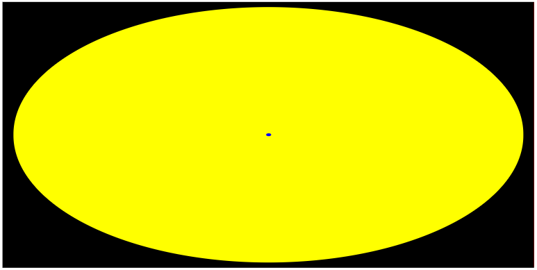
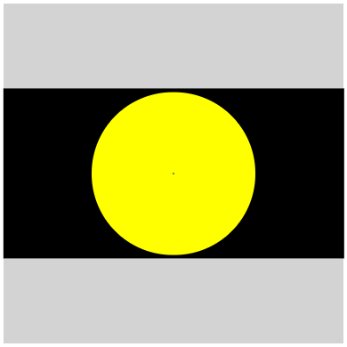

# [WIP] ScaleCosmosTagHelper

### *The intent of this library is to allow using **real-word measurements** to achieve relational comparisons of objects in digital-form via [CSS](https://en.wikipedia.org/wiki/Cascading_Style_Sheets).*

## How do I get it?

```shell
nuget install ScaleCosmosTagHelper
```

## Real-world measurements?

Things like inches, feet, and miles, don't translate well when dealing with CSS units. In fact, current standards only have `cm`, `mm`, and `in`, and those map to a fixed-number of pixels. This library's goal stretches the inclusion-map of units and uses relational-sizing to overcome the obstacles of using very small/large numbers.

## Example?

Here's an example of the HTML and what it looks like when rendered. The yellow-circle is the Sun, and the blue-dot in the center is Earth:

```html
<div class="container" sc-container height="900000 mi" width="900000 mi">
    <div class="yellow" sc-object width="864340 mi" height="864340 mi"></div>
    <div class="blue" sc-object width="7917.5 mi" height="7917.5 mi"></div>
</div>
```



## How does it work?

This library uses [Translator](https://github.com/billbogaiv/translator) for unit-conversions, but the conversions are defined within this library. The tag with the `sc-container`-attribute is used to define the overall sizizng of the digtial "cosmos"/container. All tags with `sc-object` inside the container are then sized relative to the container. Lastly, an additional wrapper-tag is injected inside the container This wrapper is sized to keep the aspect-ratio based on the container's dimensions. This has some implications on UI-design...

### CSS and aspect-ratio

Ref. [Designing An Aspect Ratio Unit For CSS](https://www.smashingmagazine.com/2019/03/aspect-ratio-unit-css/)

Until `aspect-ratio` is supported by browsers, the library depends on a "hack" by the implementer. While the library injects a tag to keep proper aspect-ratio, the "outside"-container needs to keep "square"-sizing (i.e. height and width **need** to be the same). The size of this container (in regular CSS-units) is dependent on the implementer.

```css
.container {
    height: 20vw;
    width: 20vw;
}
```

This gets what you see in the image above. However, if you change it to:

```css
.container {
    height: 20vw;
    width: 40vw;
}
```

Then, everything looks stretched (but the relational sizes are still consistent):



But, using the original CSS, if we want a wider "cosmos", then update the `sc-container`-attributes:

```html
<div class="container" sc-container height="900000 mi" width="1800000 mi">
    <!--Double the width-->
</div>
```



The "gray" represents the box of the overall "square" container while everything else is the properly-sized aspect-ratio container.

## More to come...

This is a *very* early version and will go through many changes. I'd even maybe consider a name-change altogether. Something that evokes scale and the relative nature of the library.